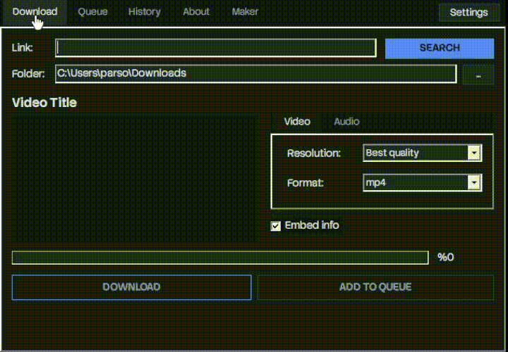
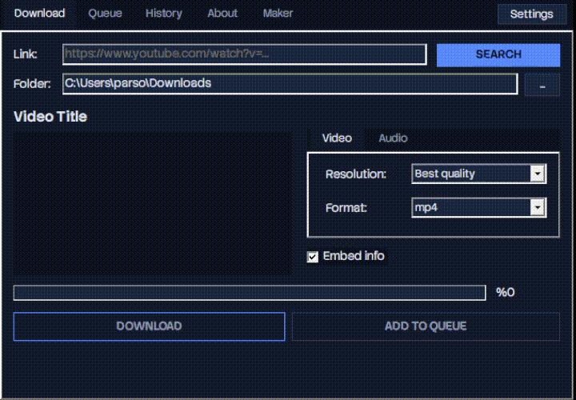
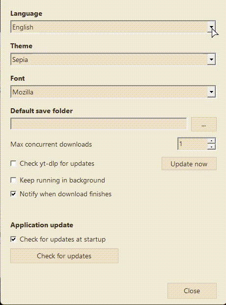
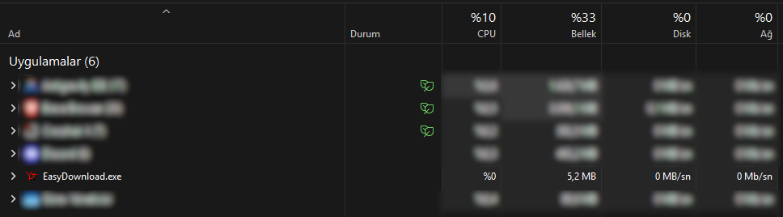
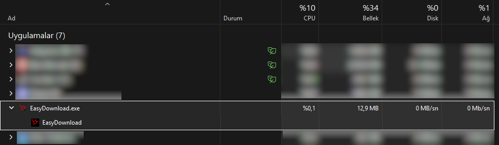
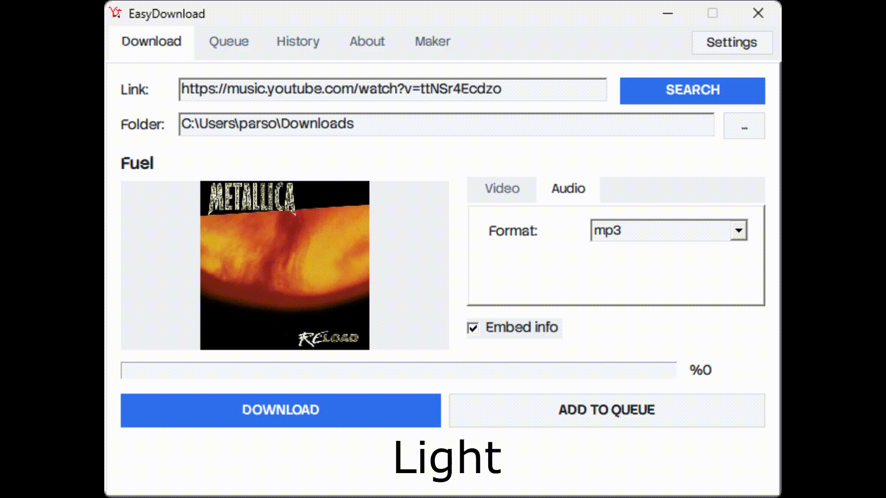

  <a href="README.ar.md">العربية</a> | 
  <a href="README.az.md">Azərbaycanca</a> | 
  <a href="README.de.md">Deutsch</a> | 
  <a href="../../README.md">English</a> | 
  <a href="README.es.md">Español</a> | 
  <strong>Français</strong> | 
  <a href="README.it.md">Italiano</a> | 
  <a href="README.pt.md">Português</a> | 
  <a href="README.ru.md">Русский</a> | 
  <a href="../README/README.tr.md">Türkçe</a>

#  EasyDownload

EasyDownload est une application de bureau gratuite, sans publicité, légère (lightweight) et open-source qui vous permet de télécharger des vidéos et des chansons YouTube et YouTube Music avec la plus haute qualité en quelques secondes.

  

---

## 🚀 Fonctionnalités

* **Prise en charge de la meilleure qualité vidéo :** Téléchargez des vidéos sans perdre leur qualité d'origine jusqu'à une résolution 4K dans les formats MP4, WebM ou MKV.
* **Convertisseur audio avancé :** Convertissez des vidéos YouTube ou des liens YouTube Music au format MP3 de haute qualité en un seul clic.
* **Intégration des informations multimédias (Embed Info) :** Intégrez automatiquement des métadonnées telles que la photo de couverture, le nom de l'artiste et le titre de la vidéo dans les fichiers téléchargés.
* **File d'attente et historique avancés :** Ajoutez plusieurs tâches de téléchargement à la file d'attente, regardez-les se télécharger séquentiellement en arrière-plan et gérez facilement vos anciens téléchargements depuis l'onglet historique.
* **Faible consommation de ressources :** Optimisé pour utiliser un minimum de RAM et de CPU, il ne ralentit jamais votre système lors de l'exécution en arrière-plan ou du téléchargement.
* **Prise en charge multilingue :** Utilisation localisée avec des options en anglais, turc, allemand, français, espagnol et bien d'autres langues.

---

## 📸 Aperçus de l'application

### 🔹 Panneau de téléchargement et menu des paramètres avancés

| ⚡ Phase de téléchargement (`downloading.gif`) | ⚙️ Menu Paramètres (`settings.gif`) |
| :---: | :---: |
| Recherchez des liens, obtenez des informations sur la vidéo et suivez la progression du téléchargement en temps réel. | Gérez les polices, les limites de téléchargement simultanées et les notifications. |
|  |  |

---

### 🔹 Performances exceptionnelles et légèreté
Contrairement aux applications modernes, EasyDownload ne consomme presque aucune ressource système. Les données du gestionnaire de tâches dans leur clarté d'origine se trouvent ci-dessous :

#### 📊 Mode inactif (`taskmanager-idle.png`)
Lorsque l'application est en arrière-plan ou en veille, elle ne consomme que **~5,2 Mo de RAM** et 0 % de processeur.

#### 📥 Pendant le téléchargement (`taskmanager-downloading.png`)
Même pendant le téléchargement actif, il offre des performances ultra-légères en ne consommant que **~12,9 Mo de RAM**.

---

## 🎨 Thèmes personnalisables

Afin de choisir celui qui convient le mieux à vos yeux, l'application propose 4 options de thèmes intégrées différentes : Midnight, Dark, Light et Sepia. Vous pouvez voir la transition fluide entre les thèmes ci-dessous :

  

---

## 📦 Téléchargement et installation

Vous pouvez accéder directement aux dernières versions stables, aux packages portables et aux anciennes versions de l'application sur la page [**GitHub Releases**](https://github.com/operseus/easydownload/releases).

* 📥 **Installation recommandée (Assistant) :** Téléchargez la dernière version stable `EasyDownload-Setup-x.x.x.exe` et terminez l'installation en quelques secondes.
* 🚀 **Version portable :** Si vous ne souhaitez laisser aucune trace sur votre système, téléchargez l'archive `EasyDownload-x.x.x-portable.zip`, extrayez-la dans n'importe quel dossier et exécutez-la directement sans installation.

---

## 🛠 Structure du projet

Ce référentiel héberge les codes du site Web de l'application, les versions et les outils d'infrastructure :
* 📁 `webserver/` - Codes source du site Web promotionnel EasyDownload et intégration de l'API de mise à jour automatique.
* 📁 `versions/` - Codes sources compilés des versions d'EasyDownload.
* 📁 `releases/` - Fichiers sources et de distribution compilés des versions d'EasyDownload.
* 📁 `docs/` - Documentation et fichiers README régionaux liés à EasyDownload.

---

## 📜 Licence

Ce projet est développé en open source et est entièrement gratuit. Pour les règles d'utilisation, les autorisations de distribution et les détails, vous pouvez consulter le fichier [**LICENSE**](https://github.com/operseus/easydownload/blob/main/LICENSE).
